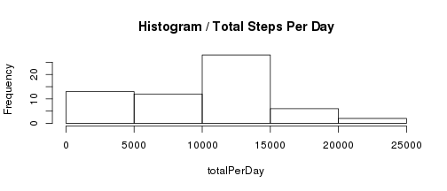
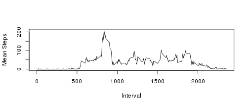
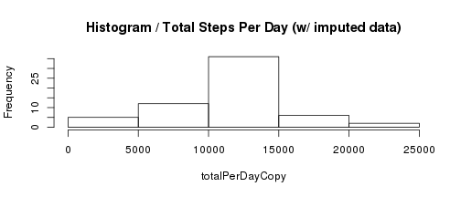
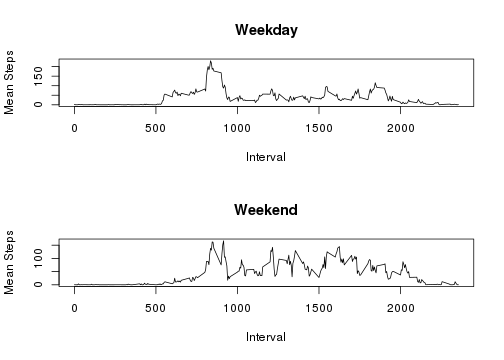

## Loading and preprocessing the data

```r
activityData <-  read.csv("data/activity.csv")

byDate <- split(activityData, as.Date(activityData$date))

totalPerDayAsList <- lapply( names(byDate), function(x) sum( byDate[[x]]$steps,na.rm=TRUE ) )
totalPerDay = unlist(totalPerDayAsList)
```

## What is mean total number of steps taken per day?


```r
hist( totalPerDay, main="Histogram / Total Steps Per Day" )
```




**Mean**: 9354.2295

**Median**: 10395

\pagebreak

## What is the average daily activity pattern?


```r
byInterval <- split(activityData, activityData$interval)
meanByIntervalList <- lapply( names(byInterval), function(x) mean( byInterval[[x]]$steps,na.rm=TRUE ))

meanByInterval <- unlist(meanByIntervalList)

plot( names(byInterval), meanByInterval, type="l", xlab="Interval", ylab="Mean Steps")
```



\pagebreak


```r
indexOfHighVal = 0
highVal = 0
for(i in 1:length(byInterval))
{
  if( meanByInterval[i] > highVal )
  {
      highVal = meanByInterval[i]
      indexOfHighVal = i
  }
}

highInterval = names(byInterval)[indexOfHighVal]
```

**Interval With Max Activity**: 835


## Imputing missing values


```r
# calculate the number of rows with missing data
numRowsWithNA <- sum(is.na(activityData$steps))

# copy the original dataframe
activityDataCopy = data.frame( activityData )

# for each row with an NA, set the value to be a derived value
# we'll just check the interval ID and use the mean for that
# interval, since we already have that calculated
naIdx <- which(is.na(activityData$steps))
names(meanByInterval) <- names(byInterval)
for( i in 1:length(naIdx) )
{
	idxToUpdate <- naIdx[i]

	intervalForUpdate <- activityDataCopy$interval[idxToUpdate]
	
	newVal <- meanByInterval[[as.character(intervalForUpdate)]]

	activityDataCopy[idxToUpdate,1] <- newVal
}


byDateCopy <- split(activityDataCopy, as.Date(activityDataCopy$date))

totalPerDayAsListCopy <- lapply( names(byDateCopy), function(x) sum( byDateCopy[[x]]$steps,na.rm=TRUE ) )
totalPerDayCopy = unlist(totalPerDayAsListCopy)
```


```r
hist( totalPerDayCopy, main="Histogram / Total Steps Per Day (w/ imputed data)" )
```



**Mean**: 10766.1887

**Median**: 10766.1887

### Do these values differ from the estimates from the first part of the assignment? What is the impact of imputing missing data on the estimates of the total daily number of steps?

Yes, using the imputed values raises the number of steps, and the histogram now appears to show a distribution that's closer to a normal
distribution / bell curve, compared to before.  


\pagebreak


## Are there differences in activity patterns between weekdays and weekends?


```r
activityDataCopy$periodFactor <- ifelse( weekdays( as.Date(activityDataCopy$date) ) == "Saturday" | weekdays(as.Date(activityDataCopy$date)) == "Sunday", "Weekend", "Weekday")

byPeriod <- split(activityDataCopy, activityDataCopy$periodFactor)

# byPeriod$Weekday
# byPeriod$Weekend

byDateWeekend <- split(byPeriod$Weekend, as.Date(byPeriod$Weekend$date))
totalPerDayAsListWeekend <- lapply( names(byDateWeekend), function(x) sum( byDateWeekend[[x]]$steps,na.rm=TRUE ) )
totalPerDayWeekend = unlist(totalPerDayAsListWeekend)
byIntervalWeekend <- split(byPeriod$Weekend, byPeriod$Weekend$interval)
meanByIntervalListWeekend <- lapply( names(byIntervalWeekend), function(x) mean( byIntervalWeekend[[x]]$steps,na.rm=TRUE ))
meanByIntervalWeekend <- unlist(meanByIntervalListWeekend)


byDateWeekday <- split(byPeriod$Weekday, as.Date(byPeriod$Weekday$date))
totalPerDayAsListWeekday <- lapply( names(byDateWeekday), function(x) sum( byDateWeekday[[x]]$steps,na.rm=TRUE ) )
totalPerDayWeekday = unlist(totalPerDayAsListWeekday)
byIntervalWeekday <- split(byPeriod$Weekday, byPeriod$Weekday$interval)
meanByIntervalListWeekday <- lapply( names(byIntervalWeekday), function(x) mean( byIntervalWeekday[[x]]$steps,na.rm=TRUE ))
meanByIntervalWeekday <- unlist(meanByIntervalListWeekday)


par(mfrow=c(2,1))
plot( names(byInterval), meanByIntervalWeekday, type="l", main="Weekday", xlab="Interval", ylab="Mean Steps" )
plot( names(byInterval), meanByIntervalWeekend, type="l", main="Weekend", xlab="Interval", ylab="Mean Steps" )
```


